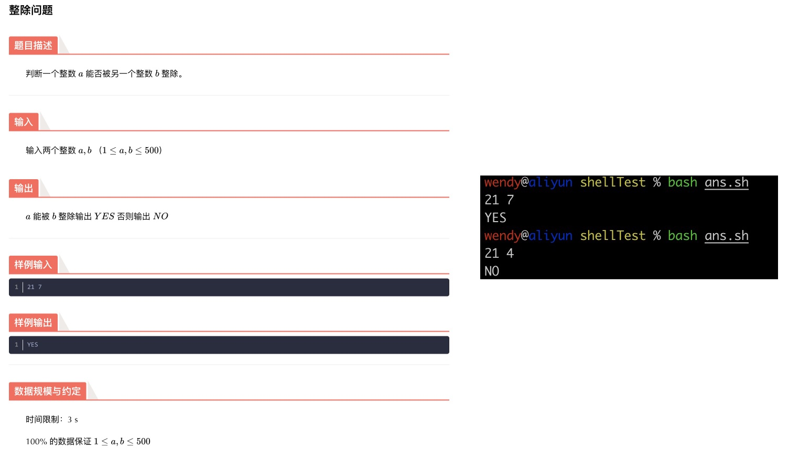
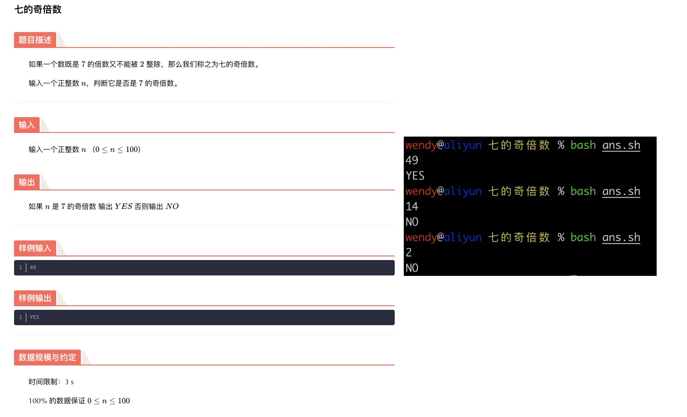
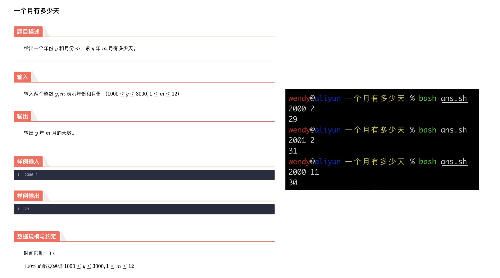
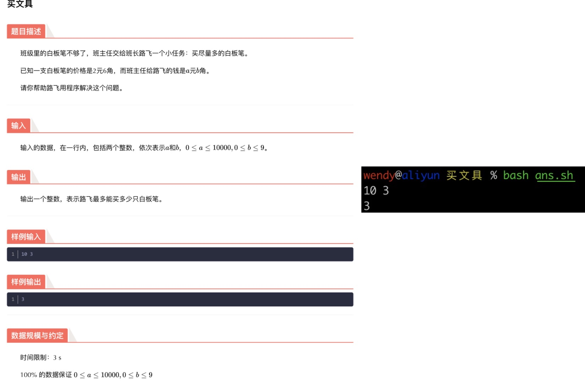
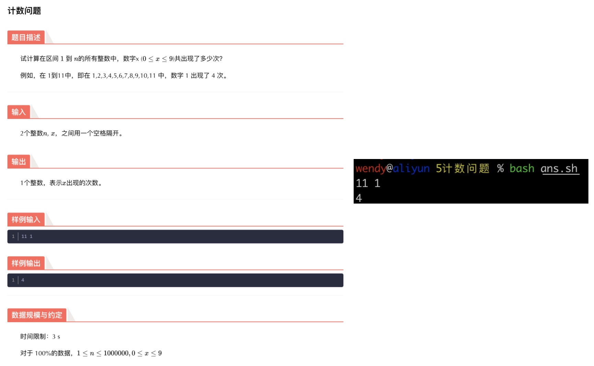
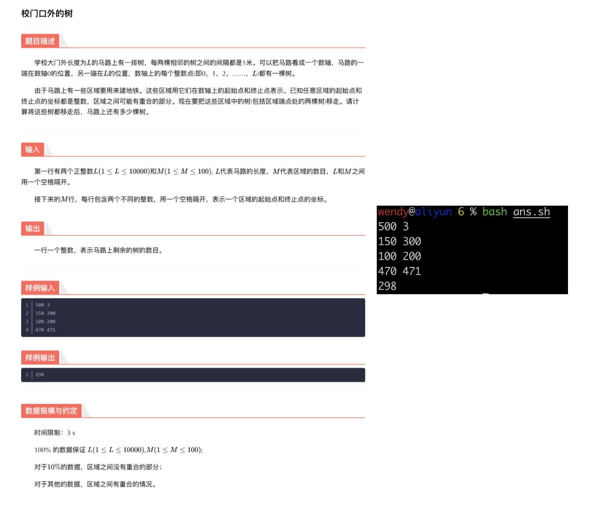
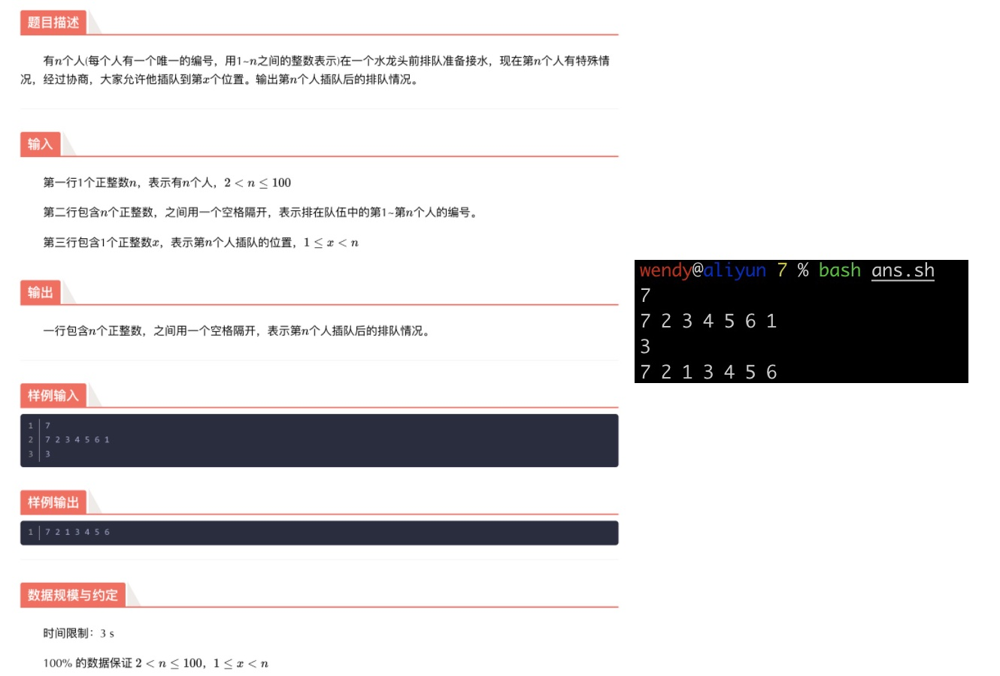
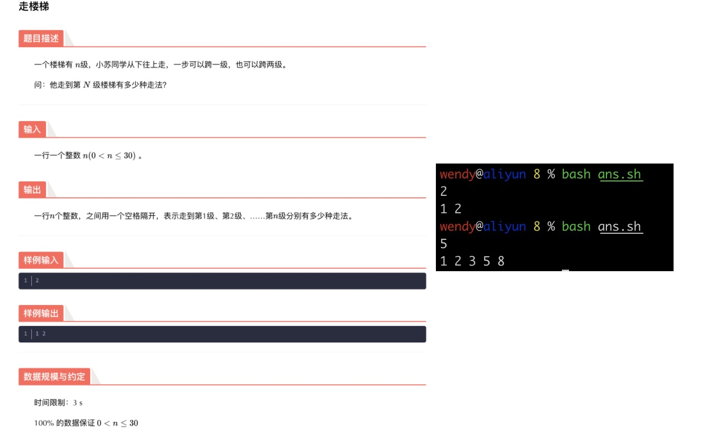
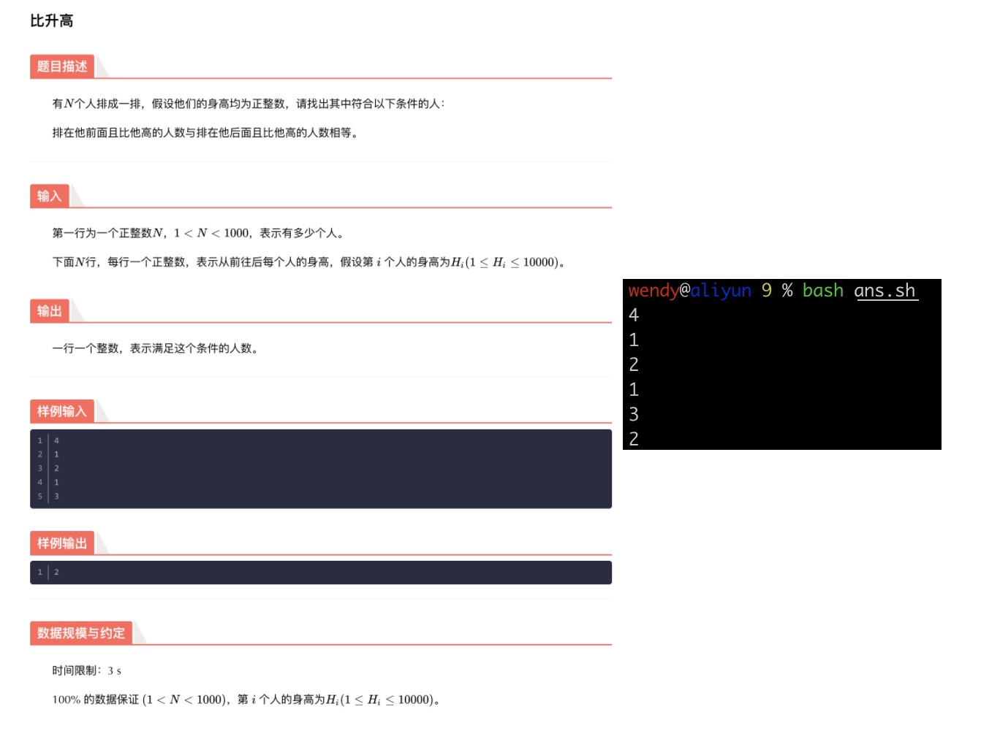
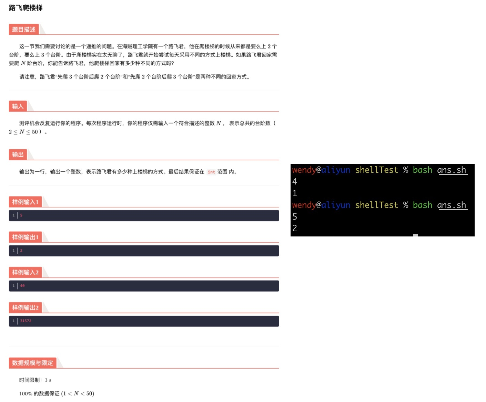

# Linux Shell Scripting

@yiqing(wendy) wang

## 1 整除问题



```shell
#!/bin/bash
read a b
# 用$[]进行计算 
if [[ $[${a} % ${b}] -eq 0 ]]; then
    echo "YES"
else
    echo "NO"
fi
```

## 2 七的奇倍数



```shell
#!/bin/bash
read n
# 先判断是否是7的倍数，再判断是否非2的倍数; 其他情况都输出NO
if [[ $[$n % 7] -eq 0 ]]; then
    if [[ $[$n % 2] -ne 0 ]]; then
        echo "YES"
    else
        echo "NO"
    fi
else
    echo "NO"   
fi
```

## 3 一个月有多少天



```shell
#!/bin/bash
# 读取年份和月份
read y m
# 用数组存放每个月的天数
daysInMonth=(31 28 31 30 31 30 31 31 30 31 30 31)
# 判断是否为闰年的二月份，是的输出29; 闰年的二月份: (y % 4 == 0) && (y % 100 != 0) && (m == 2)
function isLeapFeb() {
	  ## 能被400整除的为世纪闰年
    if [[ $[$1 % 400] -eq 0 ]]; then
        if [[ $2 -eq 2 ]]; then
            return 0
        fi
    fi
    ## 或者能被4整除但不能被100整除的都是闰年
    if [[ $[$1 % 4] -eq 0 ]]; then
        if [[ $[$1 % 100] -ne 0 ]]; then
            if [[ $2 -eq 2 ]]; then
                return 0
            fi
        fi
    fi
    return 1
}

# bash起始index为0
idx=$[ ${m} - 1]

# 判断是否为闰年的二月份
isLeapFeb ${y} ${m}

# 如果是，即$?的值等于0，输出29
if [[ $? -eq 0 ]]; then
    echo 29
else
    # 不是则输出数组中月份对应的天数
    echo ${daysInMonth[${idx}]}
fi
```

## 4 买文具



```shell
#!/bin/bash
# 思路：将10.3 / 2.6 转换成 103 / 26计算
read a b
echo $[($a * 10 + b) / 26]
```

```shell
# 或者浮点运算
# 参考资料
$ echo "scale=2;  10/3" | bc
3.33
# 这里scale=2，表示小数点后取2位，如果不加scale，默认为0，不要小数点：
$ echo "10/3" | bc          
3

# bash 不支持浮点运算，如果需要进行浮点运算，需要借助bc,awk 处理。
#方法一：
$ c=$(echo "5.01-4*2.0"|bc)
$ echo $c
-2.99
#方法二：
$ c=$(awk 'BEGIN{print 7.01*5-4.01 }')
$ echo $c
31.04
#注：在shell 中$() 与 ``等效。 中间包含命令语句执行，返回执行结果。
```

## 5 计数问题



```shell
#!/bin/bash
read n x
str=""
# 将数字拼接到一个字符串中
for (( i = 1; i <= $n; i++  )); do
    str=$str$i
done
# grep -o $x 只显示x；wc -l 统计有几个x
echo $str | grep -o $x | wc -l
```

```shell
# 参考资料整理
# grep
	## grep -o 或 --only-matching : 只显示匹配PATTERN部分
echo abcdabc1234abc | grep -o 'a' | wc -l

# regex
	## [^字符] 方括号中加入^，不匹配括号中的字符 (脱字符^); str//'字符' 去掉字符中的匹配字符
    str="abcdabc1234abc"
    str=${str//[^a]}
    echo ${#str}

# awk
	## -F '"' 表明每个词用"分隔
	## NF是number of field, 即整行(或者说record)里面词(更准确的翻译应该是域)的总数
	## NF-1 就是倒数第二个词
	test="sdfdsfds""123
	echo $test
	test=$(echo $test | awk -F '"' '{print NF-1}')
	echo $test
	## 输出：
	"sdfdsfds""123
	3
```

## 6 校门口的树



```shell
#!/bin/bash
read L M
# 接下来的M行，每行包含两个不同的整数，用一个空格隔开，表示一个区域的起始点和终止点的坐标
# 把这些区域中的树(包括区域端点处的两棵树)移走
for (( i = 0; i < $M; i++ )); do 
		read start end
		for (( j = $start; j <= $end; j++ )); do
				arr[$j]=1
		done
done
# 计算将这些树都移走后，马路上还有多少棵树  <= $L
count=0
for (( i = 0; i <= $L; i++ )); do
		if [[ arr[$i] -ne 1 ]]; then
				let count++
		fi
done
# 输出马路上剩余的树的数目
echo $count
```

## 7 插队



```shell
#!/bin/bash
# 读取人数和第1~第n个人的编号
read n
read -a arr
# 读取第n个人插队的位置
read x
# 第x-n个人的位置先顺序往后挪一位
for (( i = $n; i >= $x; i-- )); do
	arr[$i]=${arr[$[$i - 1]]}
done
# 完成插队
arr[$[$x - 1]]=${arr[$n]}
# 去掉原先第n个人的位置
unset arr[$n]
#输出数组内容
echo ${arr[*]}
```

## 8 走楼梯



```shell
#!/bin/bash
read n
# 看情况初始化走到1和2楼的走法数量
storey[0]=1;
if [[ $n -gt 1 ]]; then
	storey[1]=2;
fi
# 计算和保存3到n楼的走法数量
for (( i = 2; i < $n; i++ )); do
	storey[$i]=$[${storey[$[$i - 1]]} + ${storey[$[$i - 2]]}]
done
# 输出走到第1级、第2级、……第n级分别有多少种走法
echo ${storey[*]}
```

## 9 比身高



```shell
#!/bin/bash
read n
#
for (( i = 0; i < $n; i++ )); do
	read h
	height[$i]=$h
done
# echo ${height[*]}
# 统计 排在他前面且比他高的人数与排在他后面且比他高的人数相等 的人数。
cnt=0
for (( i = 0; i < $n; i++ )); do
	before=0
	after=0
	current=${height[$i]}
	# 统计排在他前面且比他高的人数
	for (( l = $[$i - 1]; l >= 0; l-- )); do
		left=${height[$l]}
		if [[ $left -gt $current ]]; then
			let before++
		fi
	done
	# 统计排在他后面且比他高的人数
	for (( r = $[$i + 1]; r < $n; r++ )); do
		right=${height[$r]}
		if [[ $right -gt $current ]]; then
			let after++
		fi
	done
	# 如果前后符合条件的人数相等，增加计数
	if [[ $before -eq $after ]]; then
		let cnt++
	fi
done
echo $cnt
```

## 10 爬楼梯



```shell
#!/bin/bash
read N
# 初始化走到2和3楼的走法数量
storey[1]=0;
storey[2]=1;
storey[3]=1;
# 计算和保存4到N楼的走法数量
for (( i = 4; i <= $N; i++ )); do
	storey[$i]=$[${storey[$[$i - 2]]} + ${storey[$[$i - 3]]}]
done
# 输出走到第N楼分别有多少种走法
echo ${storey[$N]}
```

## 11 斐波那契数列


```shell
#!/bin/bash
read n
# 初始化前2项
fibonacci[1]=1;
fibonacci[2]=1;

# 计算和保存前n项
for (( i = 3; i <= $n; i++ )); do
	fibonacci[$i]=$[${fibonacci[$[$i - 1]]} + ${fibonacci[$[$i - 2]]}]
done
# 输出走到第N楼分别有多少种走法
echo ${fibonacci[$n]}
```


